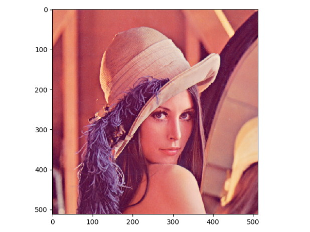
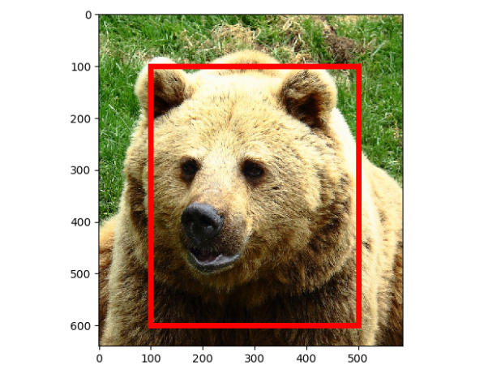
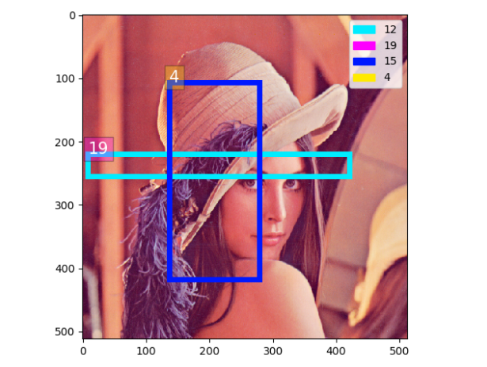
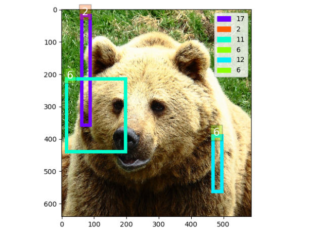

# Useful Image Utils

This repo is used for image operations. Such as, read/write, transformations ...

# Requirement
1. numpy
2. skimage

optional: opencv, PIL, imageio ...

# Supported Library

1. OpenCV (cv2)
2. Pillow (PIL)
3. Matplotlib (mpl)

There are io wrappers for the following libraries, which means you can read and write images in these libraries as you like.

And they can also be transformed to each other with numpy by the `img.py` module.

For example, you can read an PIL image and change it into OpenCV cv_mat by:

```
import img

lena_path = img.imgs['lena_png']

pil_lena = img.imread_pil(lena_path)

pil_lena_np = img.pil2np(pil_lena)

cv_lena = img.np2cv(pil_lena_np)

``` 

The numpy images are using `numpy.uint8` as default. And in most case, the transformation from different libraries will not lose pixel values' accuracy, except for some special image format which different library may have different decoding methods. For example, '.JPEG' and 'GIF' ...

```
import img

lena_path = img.imgs['lena_png']

# PIL image
lena_pil = img.imread_pil(lena_path)

# PIL -> np -> cv -> np
lena_pil_np = img.pil2np(lena_pil)
lena_pil_np_cv = img.np2cv(lena_pil_np)
lena_pil_np_cv_np = img.cv2np(lena_pil_np_cv)

# np image
lena_np = img.imread(lena_path)

lena_np == lena_pil_np_cv_np 

"""
>>> array([[[ True,  True,  True],
        [ True,  True,  True],
        [ True,  True,  True],
        ...,
        [ True,  True,  True],
        [ True,  True,  True],
        [ True,  True,  True]]])
"""
```

# Usage
## img.py
All functions are based on numpy. Useful io tools are introduced above. There are also many transform tools, such as:
```
def im_center_crop(np_img, size_x, size_y=None):
    """
    Center crop a np img
    [Ref](https://stackoverflow.com/questions/39382412/crop-center-portion-of-a-numpy-image)
    :param np_img: H, W, C
    :param size_x: crop size_x
    :param size_y: crop size_y
    :return: cropped img
    """


def im_crop(np_img, box, ok_out=True):
    """
    Crop an image patch within a bounding box.
    :param np_img: H, W, C
    :param box: top_left_x, top_left_y, width, height
    :param ok_out: out of boundary is OK or not, {True} | False
    :return: np img
    """


def im_hflip(np_img):
    """
    Horizontally flip an img
    :param np_img: np img H,W,C
    :return: np img
    """


def im_vflip(np_img):
        """
        Vertically flip an img
        :param np_img: np img H,W,C
        :return: np img
        """


def im_mean(np_img_list):
    """
    Compute the RGB channel mean for a group of images.
    :param np_img_list: list of np imgs
    :return: [R_mean, G_mean, B_mean] or [gray]
    """


def im_resize(np_img, size):


def im_rotate(np_img, angle=0):


def im_from_txt(txt_paths):
    """
    Load img from txt.
    :param txt_paths: [txt_file_path]
    :return: np img
    """

def im_to_txt(np_img, txt_path):
    """
    Save np img to txt file
    :param np_img: np img
    :param txt_path: txt path
    """

```

Most of the functions are commented, except easy ones.

## draw.py

Helper module to draw and show pictures using matplotlib. 
A typical pipeline can be summarized as following code:

```
import img
import numpy as np

lena = img.imread(img.imgs['lena_png'])
bear = img.imread(img.imgs['bear_jpg'])

drawer = Drawer(lena)
drawer.show()

drawer.set_img(bear)
drawer.draw_img()
drawer.show()

box_1 = [100, 100, 400, 500]
drawer.draw_bbox(box_1)
drawer.draw_legend()
drawer.show()

drawer.clear()
num_colors = 20
drawer.set_num_colors(num_colors)

for i in range(1, 20):
    H, W, _ = drawer.get_img.shape

    tl_x = np.random.randint(W)
    tl_y = np.random.randint(H)
    w = np.random.randint(W - tl_x)
    h = np.random.randint(H - tl_y)
    box_2 = [tl_x, tl_y, w, h]
    color1 = np.random.randint(num_colors)
    color2 = np.random.randint(num_colors)

    drawer.draw_bbox(box_2, color=drawer.get_color(color1))
    drawer.draw_text(tl_x, tl_y, str(color2), box_color=drawer.get_color(color2))
    drawer.add_legend(color=drawer.get_color(color1), label=str(color1))
    drawer.add_legend(color=drawer.get_color(color2), label=str(color2))
    drawer.draw_legend()
    drawer.show()

    if i % 3 == 0:
        drawer.clear()

    if i % 8 == 0:
        drawer.clear_all()
        drawer.set_img(lena)

```
Here is some results:






# APIs
## img.py
```
...
```
## draw.py
```
...
```